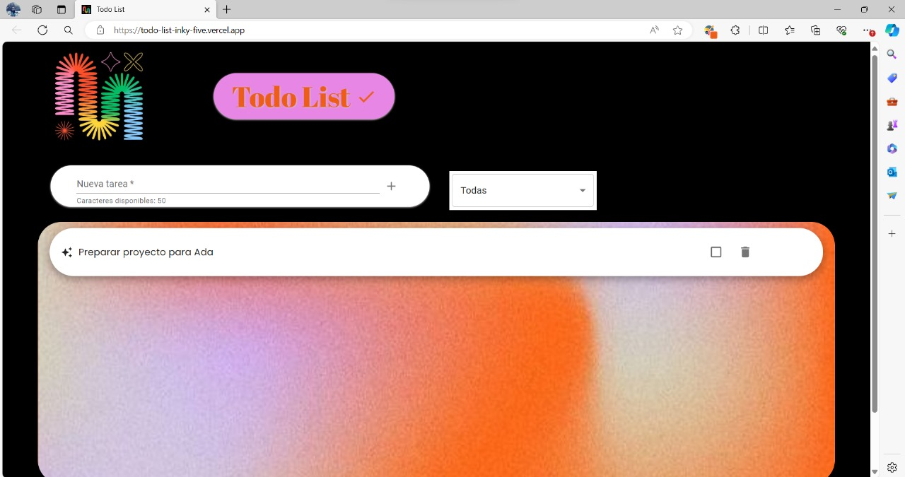
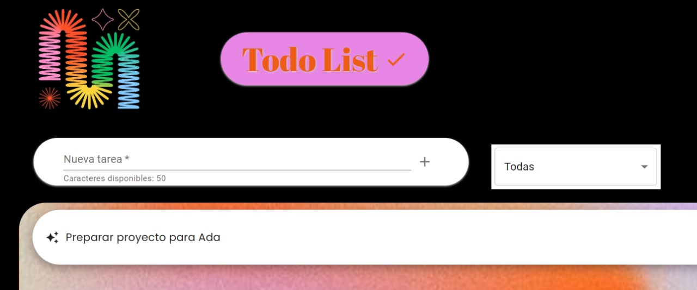
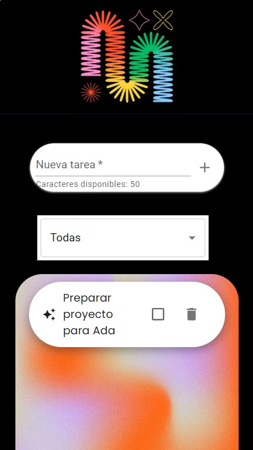

# ToDo List

Este es un proyecto de ToDo List desarrollado con React. Puedes encontrar la aplicación deployada [aquí](https://todo-list-inky-five.vercel.app/).

## Descripción

Este proyecto es una simple aplicación de lista de tareas donde los usuarios pueden agregar nuevas tareas, marcarlas como completadas y eliminarlas de la lista.

## Características

- Agregar nuevas tareas.
- Marcar tareas como completadas.
- Eliminar tareas de la lista.
- Diseño responsive para adaptarse a diferentes tamaños de pantalla.

## Instalación

Para ejecutar este proyecto localmente, sigue estos pasos:

1. Clona este repositorio en tu máquina local:

## Tecnologías Utilizadas

- React
- Material-UI

## Autor
Este proyecto fue desarrollado por Maca Iglesias Ghys.